# FreshMart 🥬

A freshness-first online grocery for fresh produce in Malaysia.

Built with PHP 8 + MariaDB + vanilla CSS/JS. Final Year Project, MMU.

---

## 🚀 How to Run the Website

You need **XAMPP** installed (PHP + MariaDB included). Get it from https://www.apachefriends.org/.

### 1. Place the code

Extract the project so the final path is:

```
C:\xampp\htdocs\freshmart\
```

### 2. Start XAMPP

Open **XAMPP Control Panel** → click **Start** next to:
- ✅ **Apache**
- ✅ **MySQL**

### 3. Create the database

1. Open http://localhost/phpmyadmin
2. Click **New** (left sidebar) → create database named `freshmart`
3. Click into `freshmart` → click **Import** tab
4. Choose `database\schema.sql` → click **Go**
5. Click **Import** again → choose `database\seed.sql` → click **Go**

### 4. Open the site

Go to:

```
http://localhost/freshmart/public
```

Done! 🎉

---

## 🔑 Test Accounts

| Role | Email | Password |
|---|---|---|
| Admin | `admin@freshmart.my` | `Admin@123` |
| Retailer | `retailer@cameron.my` | `Retailer@123` |
| Customer | `cherry@example.my` | `Customer@123` |

Login at: http://localhost/freshmart/public/auth/login.php

After login the site auto-redirects:
- **Admin** → admin dashboard
- **Retailer** → retailer dashboard
- **Customer** → home page

---

## 🌟 Core Features

| Feature | What it does |
|---|---|
| **Freshness Indicator** | Power-law decay formula — every product shows live freshness % (Very Fresh → Last Chance) |
| **FEFO Inventory** | First-Expired-First-Out batch selection at checkout — minimizes food waste |
| **Auto-Discount** | Items entering Last Chance automatically drop 15% |
| **Voucher System** | Admin creates promo codes, customers apply at checkout |
| **Review Moderation** | Admin approves reviews, retailers can reply (like Shopee) |

---

## 📁 Project Structure

```
freshmart/
├── public/             ← Web root (what XAMPP serves)
│   ├── index.php       ← Homepage
│   ├── auth/           ← Login, register, logout
│   ├── shop/           ← Customer pages (browse, cart, checkout, etc.)
│   ├── retailer/       ← Retailer dashboard
│   ├── admin/          ← Admin panel
│   └── assets/         ← CSS, JS, images
├── includes/           ← Core libraries (config, helpers, freshness, FEFO)
├── database/           ← SQL schema + seed data
└── cron/               ← Background jobs (auto-expire, auto-discount)
```

---

## 🛠 Common Issues

**"Database connection failed"**
→ Open `includes\config.php` and check `DB_USER='root'` and `DB_PASS=''` (XAMPP default).

**Pages look unstyled / broken layout**
→ Make sure `public\assets\css\main.css` exists.

**"Access denied" when login**
→ The seed data uses bcrypt passwords. If you reseeded and login fails, re-import `database\seed.sql`.

---

Made by Cherry · MMU Computer Science FYP

## 📸 Screenshots

A walkthrough of the customer shopping flow.

### Home
The landing page greets the logged-in customer with live store stats (active products, food saved from waste, last-chance items, approved retailers), usable vouchers, and a "Today's Fresh Picks" carousel.

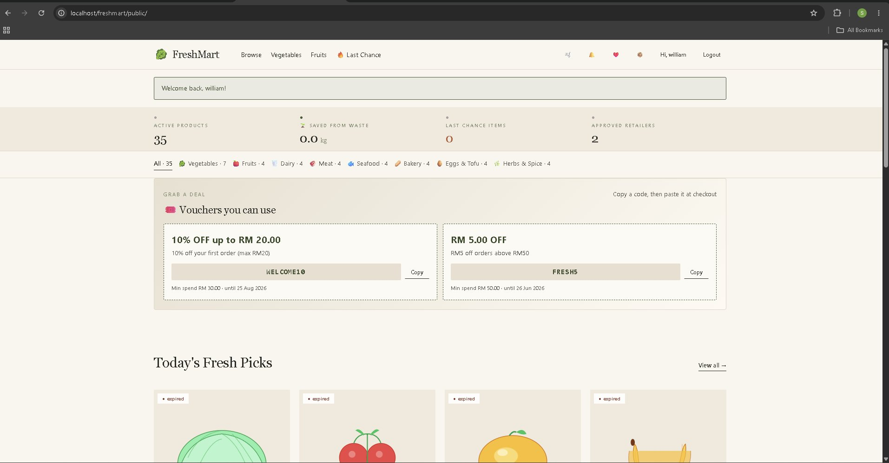

### Browse Products
Customers can search and filter by category, availability (in stock / low stock) and freshness. Each card shows the freshness badge (Enjoy Soon / Last Chance), auto-discount, origin, and best-before date.

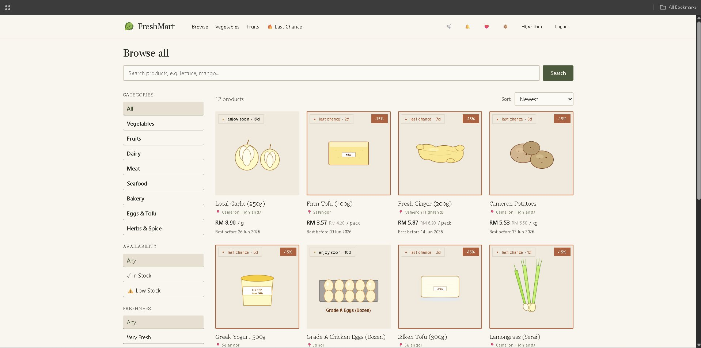

### Product Detail
Each product shows a **live freshness meter** and a **7-day freshness forecast** computed from the batch's age using the power-law decay model `(1 − t/T)^n`, where `n` is the category's decay exponent. Batch info follows FEFO (First-Expired-First-Out).

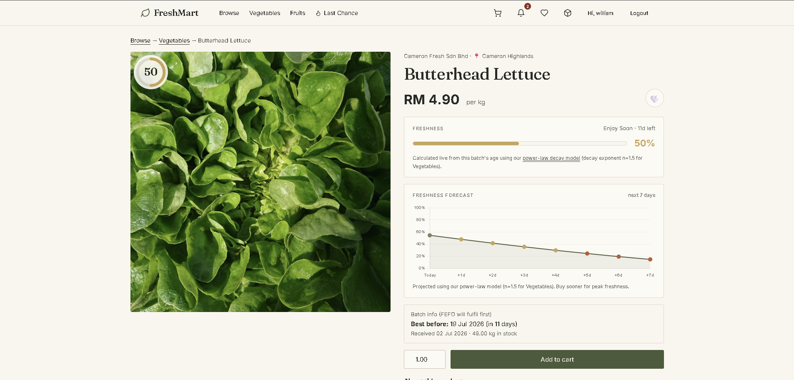

### Cart
The cart shows order summary, free-shipping progress, and the promo codes the customer can unlock.

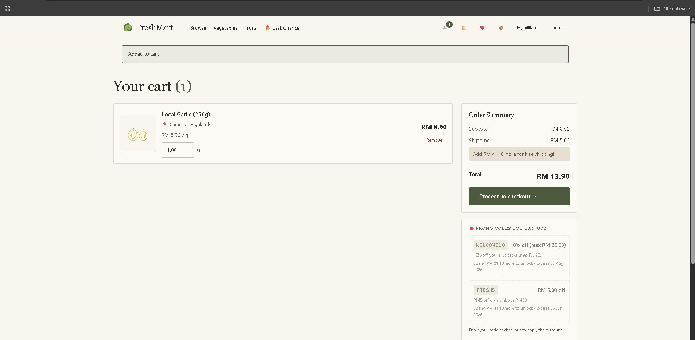

### Checkout
Shipping address, preferred delivery day, payment method (FPX / Card / E-Wallet / Transfer / COD), and voucher entry. Payment is simulated for the FYP demo.

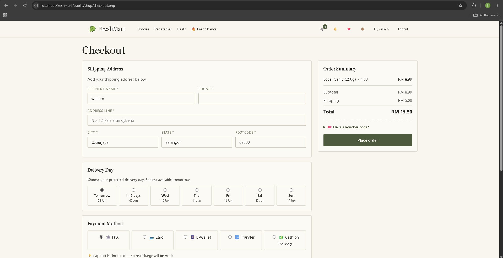

### Order Confirmation
After placing an order, the customer gets an order number, batch + freshness state of the fulfilled item, shipping details, and a tracking code.

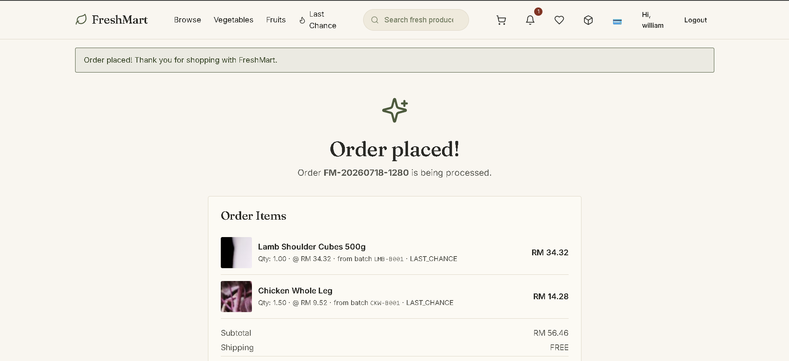

### Notifications
In-app notifications keep the customer updated on order status.

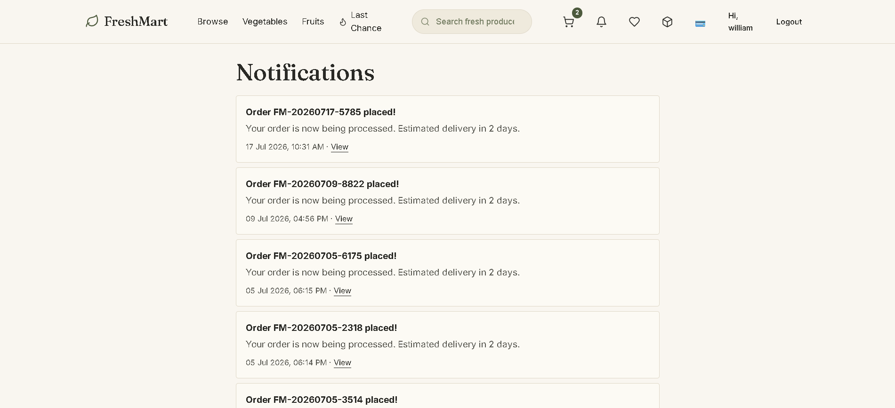

### Wishlist
Customers can save products for later by tapping the heart on any product.

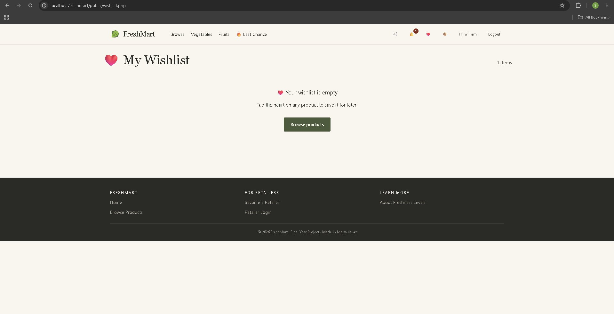

### My Orders
Order history with status badges (e.g. PLACED) and totals.

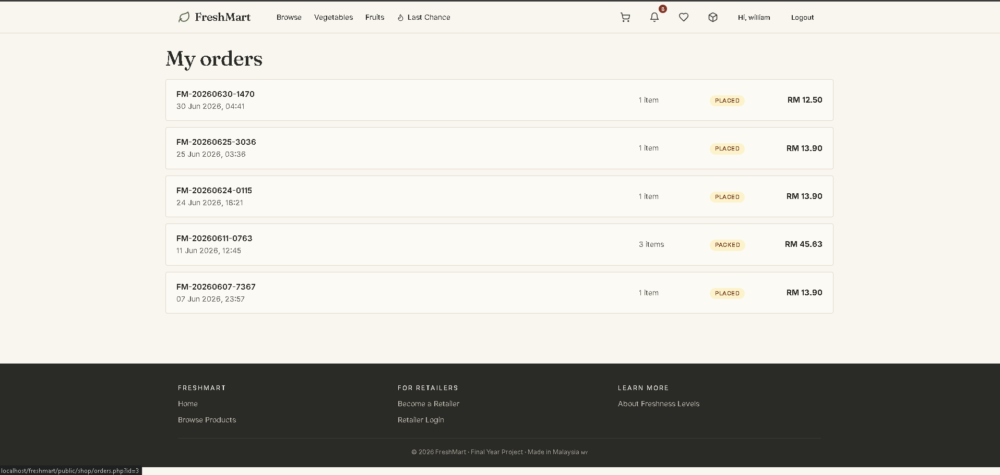

## 📸 Screenshots

### Customer Storefront

A walkthrough of the customer shopping flow.

**Home** — live store stats (active products, food saved from waste, last-chance items, approved retailers), usable vouchers, and a "Today's Fresh Picks" carousel.


**Browse Products** — search and filter by category, availability, and freshness. Each card shows the freshness badge (Enjoy Soon / Last Chance), auto-discount, origin, and best-before date.


**Product Detail** — a **live freshness meter** and a **7-day freshness forecast** computed from the batch's age using the power-law decay model `(1 - t/T)^n`, where `n` is the category's decay exponent. Batch selection follows FEFO (First-Expired-First-Out).


**Cart** — order summary, free-shipping progress, and unlockable promo codes.


**Checkout** — shipping address, preferred delivery day, payment method (FPX / Card / E-Wallet / Transfer / COD), and voucher entry. Payment is simulated for the demo.


**Order Confirmation** — order number, fulfilled batch + freshness state, shipping details, and a tracking code.


**Notifications** — in-app notifications for order status updates.


**Wishlist** — save products for later by tapping the heart on any product.


**My Orders** — order history with status badges and totals.


---

### Admin Panel

The admin manages users, retailers, orders, reviews, and store-wide settings.

**Dashboard** — total revenue, key business metrics (orders, customers, food saved from waste), inventory counts, and charts for revenue, orders by status, customer growth, and revenue by category.

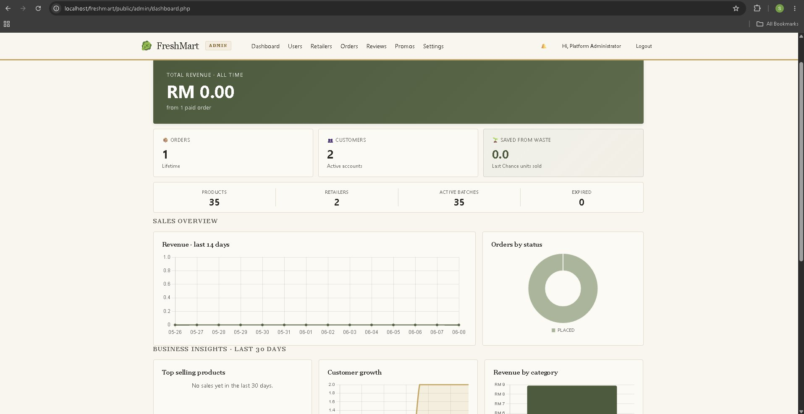

**User Management** — view all users filtered by role (customers, retailers, admins), with status and the ability to suspend accounts.

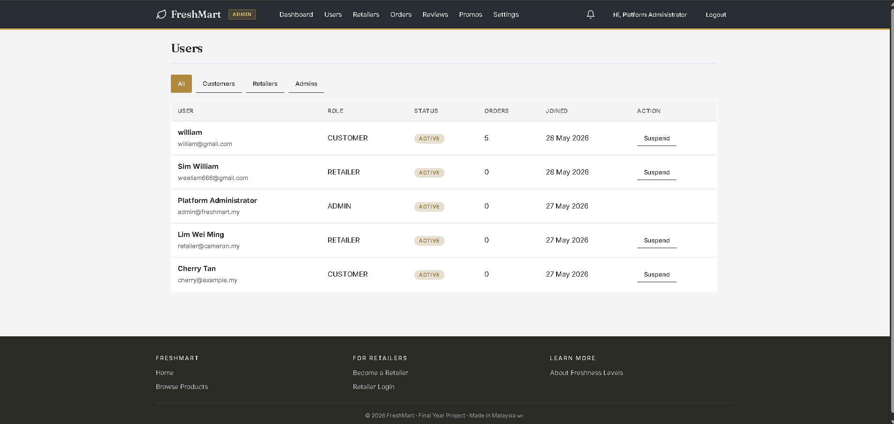

**Retailer Management** — review retailer applications by status (Pending / Approved / Rejected / Suspended), including SSM registration details.

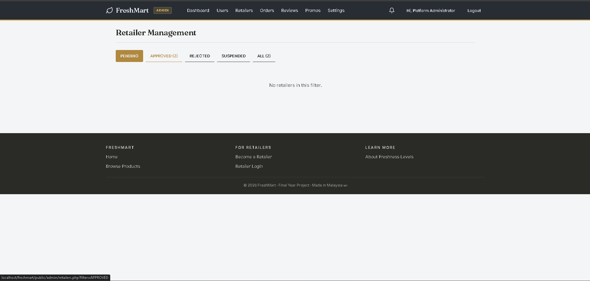

**Order Management** — all orders with totals, status filters, and search.

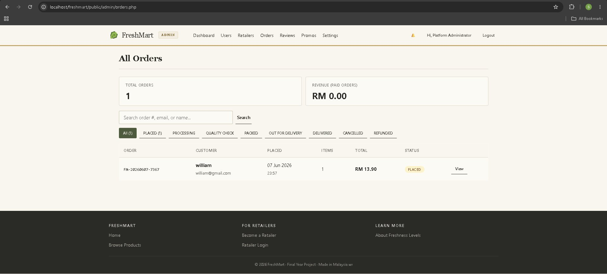

**Review Moderation** — approve or reject customer reviews before they go live, with rating filters.

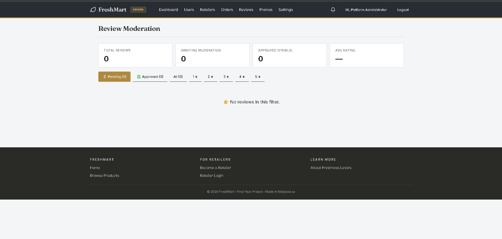

**Promo Codes** — create and manage voucher codes with discount type, minimum order, usage limit, and validity period.

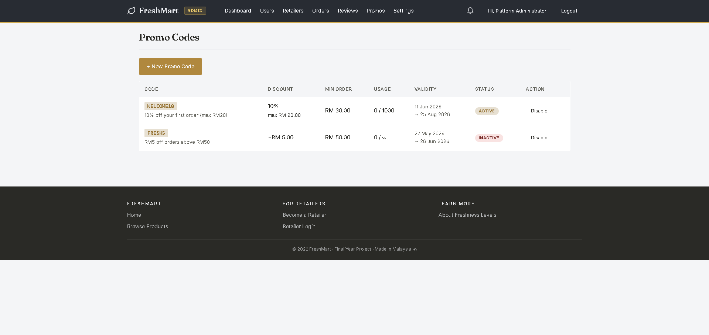

**System Settings** — store-wide configuration: site name, support email, currency, timezone, shipping and tax.

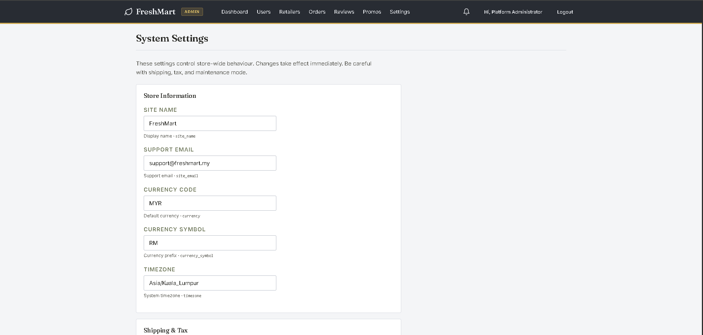

---

### Retailer Panel

Retailers manage their own products, stock batches, orders, and performance.

**Dashboard** — total products, active stock batches, low-stock alerts, and a "Batches Expiring Soon" table with live freshness state.

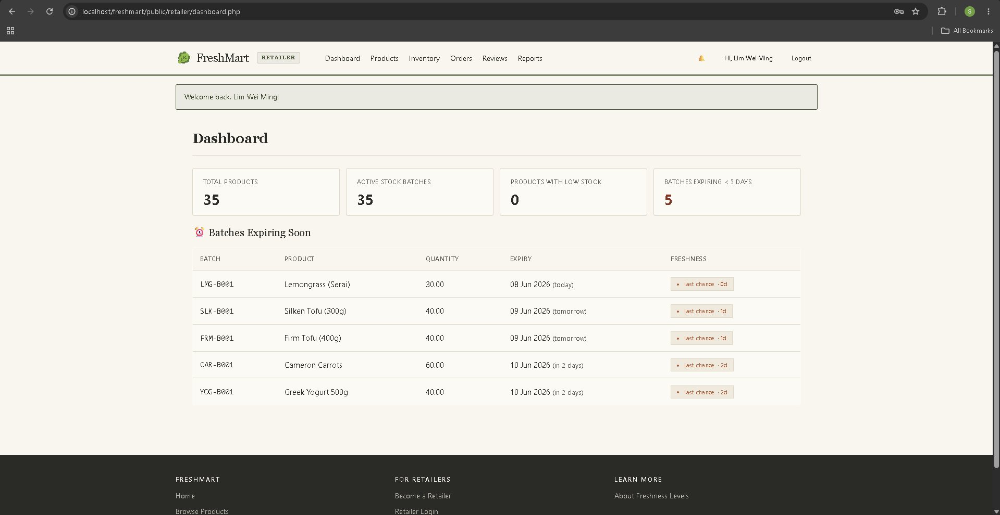

**Inventory (FEFO Batches)** — stock batches sorted by expiry (earliest first), so the next batch to sell is always at the top. Each row shows received date, expiry, quantity, freshness, and status.

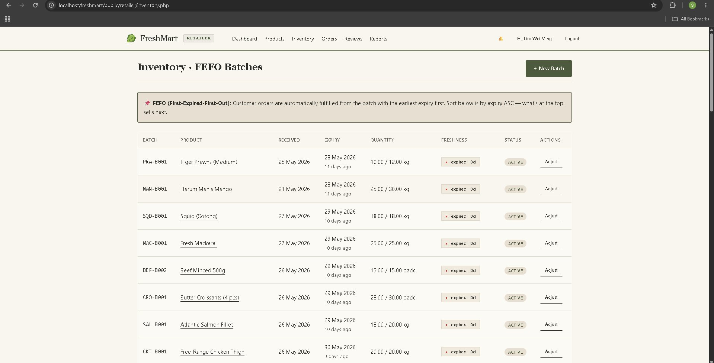

**Orders** — incoming orders showing the retailer's own sales, with status workflow (Placed -> Processing -> Quality Check -> Packed -> Out for Delivery -> Delivered).

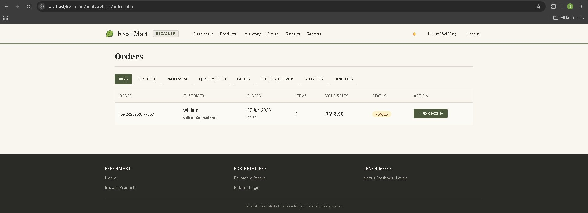

**Product Performance Report** — sales, units sold, revenue, stock, views, conversion rate, and units saved from waste per product, with date range filter and CSV export.

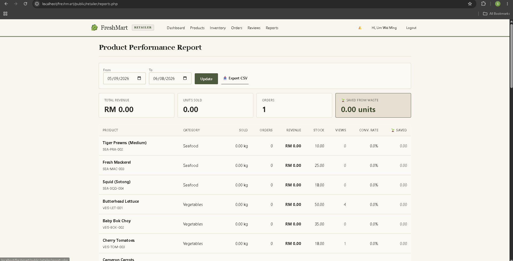